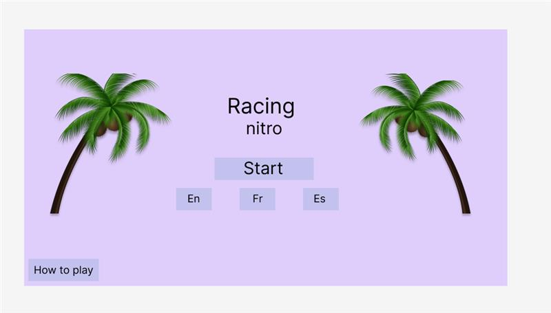
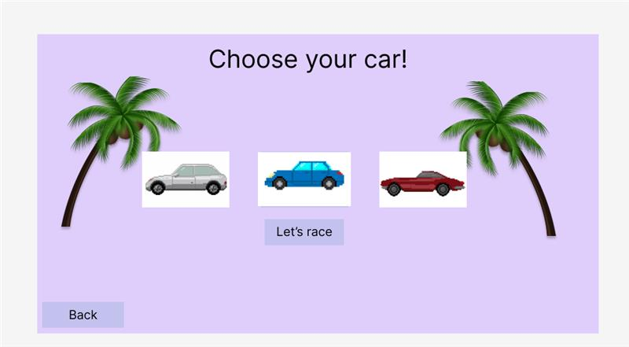
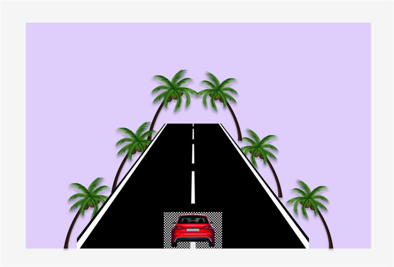

# Jeux de voitures avec javascript

## Aperçu


## Auteure
- [@Nchargui](https://github.com/Nchargui)
- [@Aya](https://github.com/AyaIssa1)
  
## Collaboration
Pour ce travail de 40%, Nadine et Aya se sont vraiment partagé la tâche. Chacune a travaillé sur chaque partie du projet. Si une personne ne comprenait pas, l'autre venait l'aider et ainsi de suite. Aussi, nous avons seulement merge une seule fois alors il se peut que des commits ne soit pas dans le main, mais dans la branche "racing" ou encrore "racingTest"

# Atelier 4 Jeux
## Instructions pour accéder au jeu

Le jeu se trouve sur la branche `main`. Suivez les étapes ci-dessous pour y accéder :


> [!NOTE]
> Vous pouver aussi télécharger la dernière version du répertoire


1. Cloner le projet depuis GitHub :
```sh
   git clone https://github.com/Nchargui/Atelier4_jeux.git
```

2. Entrer dans le dossier cloné :
```sh
    cd Atelier4_jeux
```
   
5. Ouvrir le projet dans Visual Studio Code :
```sh
   code .
```

6. Aller dans le fichier "jeux"

7. Installer l'extension Live Server sur Visual Studio Code.
   
8. Lancer la page HTML PageAccueil.html :

9. Faites un clic droit sur le fichier PageAccueil.html.
   
10. Sélectionnez "Open with Live Server".

   


> [!IMPORTANT]
> ### Configuration de la Manette
>  Connectez votre manette Bluetooth, de préférence une manette PlayStation. Si vous en avez pas, vous pouver utilsier
> le clavier, mais noter que la manette reste tout de même une meilleure option.
>  Naviguez sur les pages pour commencer à jouer.


  
## Fonctionnalités
- [x] Menu du jeu
- [ ] Pouvoir choisir la voiture entre des modèles
- [x] Pouvoir changer la langue du jeu (seulement menu)
- [x] Interface responsive (seulement jeu)
- [x] bouger la voiture avec la manette
- [x] bouger la voiture avec le clavier
- [x] attraper les cônes sous un minuteur
- [ ] faire avancer d'autre voiture ennemies

## Rapport d'essais 
voir le fichier sur les [Rapport d'essais](https://github.com/Nchargui/Atelier4_jeux/tree/main/RapportDessais)

## Guide de conception
voir le fichier sur les [Guide de conception](https://github.com/Nchargui/Atelier4_jeux/tree/main/Maquette_GuideConception/GuideDeConception)

## Maquettes

### Avant : 


### Après : 





